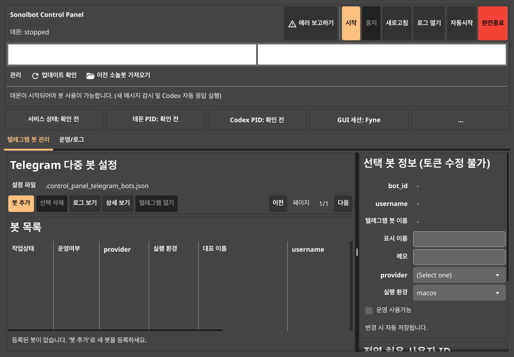

# Sonolbot Universal

Windows와 macOS용 Sonolbot 보안강화 배포 패키지입니다.

일반 사용자는 소스코드를 빌드하지 말고 아래 직접 다운로드 링크에서
`sonolbot_universal.zip`을 받으세요.

## 바로 다운로드

- Sonolbot Universal 다운로드:
  https://github.com/volition79/sonolbot-universal/releases/latest/download/sonolbot_universal.zip
- 체크섬:
  https://raw.githubusercontent.com/volition79/sonolbot-universal/main/SHA256SUMS.txt
- 릴리스 페이지:
  https://github.com/volition79/sonolbot-universal/releases/latest
- 현재 버전: `0.1.21`
- 현재 zip SHA256: `97e7b1fed303747434f42146eeafd17016341aba77cedfaa557c4fa331ca08a4`

이 저장소는 수동 최초 설치용 최신 패키지를 제공하는 곳입니다.
설치 후 새 버전 확인과 업데이트는 Sonolbot 내부 업데이트 확인 기능을 사용하세요.

## 설치 및 실행 순서

압축을 푼 뒤 본인 컴퓨터에 맞는 하위 폴더에서 실행하세요.

### Windows 64-bit

`sonolbot_universal/windows-amd64/` 폴더로 들어간 뒤 아래 파일을 순서대로 더블클릭하세요.

1. `1.사전점검.bat`
2. `2.설치하기.bat`
3. Codex를 쓸 경우 `3.코덱스로그인.bat`
4. Claude Code를 쓸 경우 `4.클로드코드로그인.bat`
5. `5.제미나이로그인.bat`는 현재 사용하지 않으므로 실행하지 않아도 됩니다.
6. `6.컨트롤패널.bat`

Codex 또는 Claude Code 중 하나만 정상 로그인되어도 사용할 수 있습니다.

### macOS Apple Silicon

Apple Silicon Mac은 `sonolbot_universal/macos-arm64/` 폴더를 사용하세요.

### macOS Intel

Intel Mac은 `sonolbot_universal/macos-amd64/` 폴더를 사용하세요.

### macOS 실행 방법

macOS의 `.command` 파일은 터미널에서 실행하는 것을 권장합니다.

1. Finder에서 본인 Mac에 맞는 폴더를 엽니다.
2. 폴더 안의 빈 공간을 마우스 오른쪽 클릭합니다.
3. `폴더에서 새로운 터미널 열기` 또는 `서비스 > 폴더에서 새로운 터미널 열기`를 선택합니다.
4. 터미널이 열리면 아래 명령을 순서대로 입력합니다.

터미널이 이미 해당 폴더에서 열렸다면 첫 번째 `cd ...` 줄은 입력하지 않아도 됩니다.
경로를 직접 쓰기 어렵다면 터미널에 `cd `를 입력한 뒤 Finder의 폴더를 터미널로 끌어다 놓고 Enter를 누르세요.

Apple Silicon:

```bash
cd /다운로드한/위치/sonolbot_universal/macos-arm64
chmod +x *.command scripts/run_go_client.sh sonolbot-go-client/sonolbot-client sonolbot-go-client/sonolbot-control-panel
xattr -dr com.apple.quarantine .
./1.사전점검.command
./2.설치하기.command
./3.코덱스로그인.command
./6.컨트롤패널.command
```

Intel Mac:

```bash
cd /다운로드한/위치/sonolbot_universal/macos-amd64
chmod +x *.command scripts/run_go_client.sh sonolbot-go-client/sonolbot-client sonolbot-go-client/sonolbot-control-panel
xattr -dr com.apple.quarantine .
./1.사전점검.command
./2.설치하기.command
./3.코덱스로그인.command
./6.컨트롤패널.command
```

Claude Code를 쓸 경우 `./3.코덱스로그인.command` 대신 또는 추가로 `./4.클로드코드로그인.command`를 실행하세요.
`./5.제미나이로그인.command`는 현재 사용하지 않으므로 실행하지 않아도 됩니다.

macOS 컨트롤패널에서는 `업데이트 확인`, `이전 소놀봇 가져오기`가 화면 최상단 메뉴바와 패널 내부 `관리` 영역에 함께 표시됩니다.
자동시작을 켜면 사용자 `~/Library/LaunchAgents`에 등록되어 다음 로그인부터 패널과 데몬 자동 시작에 사용됩니다.

## 6번 컨트롤패널 실행 후 사용 순서

`6.컨트롤패널` 실행에 성공하면 아래와 같은 Sonolbot Control Panel이 열립니다.



이후 아래 순서로 설정하세요.

1. **텔레그램 허용 사용자 ID 추가**
   - 오른쪽 아래 `전역 허용 사용자 ID` 영역에 본인의 Telegram 숫자 ID를 입력합니다.
   - `ID 추가`를 누르고 성공 안내가 뜨면 등록 완료입니다.
   - 이 ID에 포함되지 않은 사용자의 메시지는 봇이 처리하지 않습니다.

2. **봇 추가**
   - `텔레그램 봇 관리` 탭에서 `봇 추가`를 누릅니다.
   - Telegram BotFather에서 만든 봇 토큰을 입력하고 검증합니다.
   - `provider`는 사용할 실행기를 선택합니다.
     - Codex를 사용할 경우: `codex`
     - Claude Code를 사용할 경우: `claude-code`
   - 실행 환경은 OS에 맞게 자동 제한됩니다.
     - Windows: `wsl`
     - macOS: `macos`
   - Claude Code로 봇을 만들 때 로그인 또는 실행 준비가 안 되어 있으면 `4.클로드코드로그인`을 먼저 실행한 뒤 다시 시도하세요.

3. **이전 Sonolbot 가져오기**
   - 기존 설치본을 이어서 쓰려면 `관리` 영역 또는 macOS 상단 메뉴의 `이전 소놀봇 가져오기`를 누릅니다.
   - 기존 Sonolbot 폴더를 선택한 뒤 안내에 따라 가져오기를 적용합니다.
   - 가져오기 후 봇 목록과 설정이 표시되는지 확인하고, 필요하면 provider와 실행 환경을 다시 확인하세요.

4. **데몬 시작**
   - 봇이 `운영 사용가능` 상태인지 확인합니다.
   - 상단의 `시작` 버튼을 누릅니다.
   - 상태가 `데몬: 실행 중`으로 바뀌면 Telegram 메시지 감시와 자동 응답이 시작됩니다.

5. **Telegram에서 대화 테스트**
   - Telegram에서 등록한 봇에게 짧은 메시지를 보냅니다.
   - 답변이 오면 기본 구동이 완료된 것입니다.
   - 답변이 오지 않으면 허용 사용자 ID, 봇 토큰, provider 로그인 상태, 데몬 실행 상태를 먼저 확인하세요.

6. **업데이트 확인**
   - 설치 후 새 버전은 패널의 `업데이트 확인`에서 적용합니다.
   - 이 공개 저장소는 최초 설치용 패키지이며, 일반 업데이트는 Sonolbot 내부 업데이트 기능을 기준으로 진행합니다.

7. **문제가 있을 때 에러보고하기**
   - 실행, 로그인, 봇 추가, 모델 변경, Telegram 응답 문제가 있으면 상단의 `에러 보고하기`를 누르세요.
   - 최근 로그와 진단 정보가 서버로 전송되어 원인 분석에 사용됩니다.
   - 토큰 같은 민감값은 진단 패키지 생성 과정에서 마스킹됩니다.

## macOS Gatekeeper 안내

현재 패키지는 Apple notarization을 적용하지 않은 내부/소수 사용자용 배포입니다.
macOS에서 "확인되지 않은 개발자" 또는 quarantine 차단이 나오면,
해당 하위 폴더에서 터미널로 아래 명령을 실행한 뒤 다시 여세요.

```bash
xattr -dr com.apple.quarantine .
```

## 보안 구성

- 실행 바이너리는 `garble` 기반 obfuscated release build입니다.
- 개인 토큰, 봇 설정, 작업 기록, 로그, runtime 상태는 포함하지 않습니다.
- 서버 artifact와 내부 개발자 문서는 포함하지 않습니다.
- 업데이트/활성화 정책은 Sonolbot 서버의 signed update 경로를 기준으로 운영합니다.

## 무결성 확인

릴리스의 `SHA256SUMS.txt` 또는 이 저장소의 `SHA256SUMS.txt`를 확인하세요.
